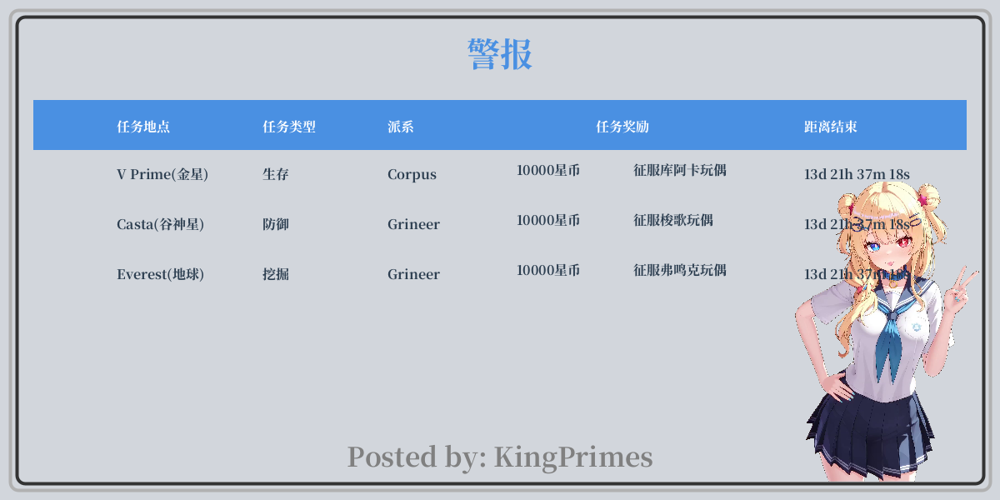
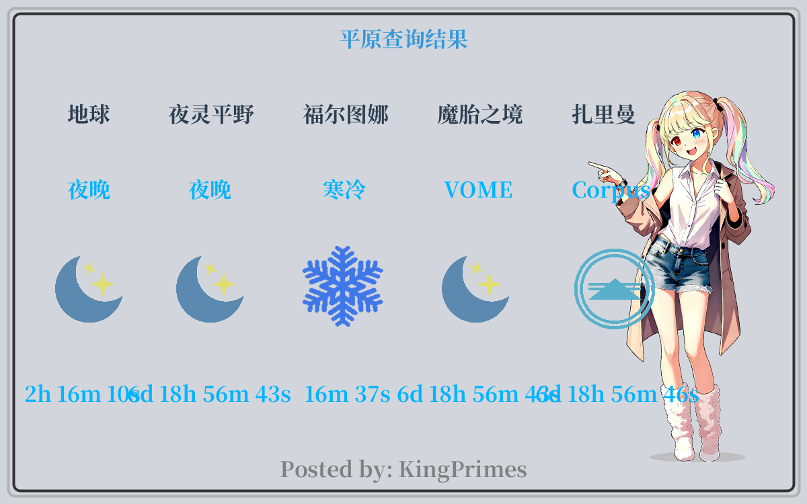
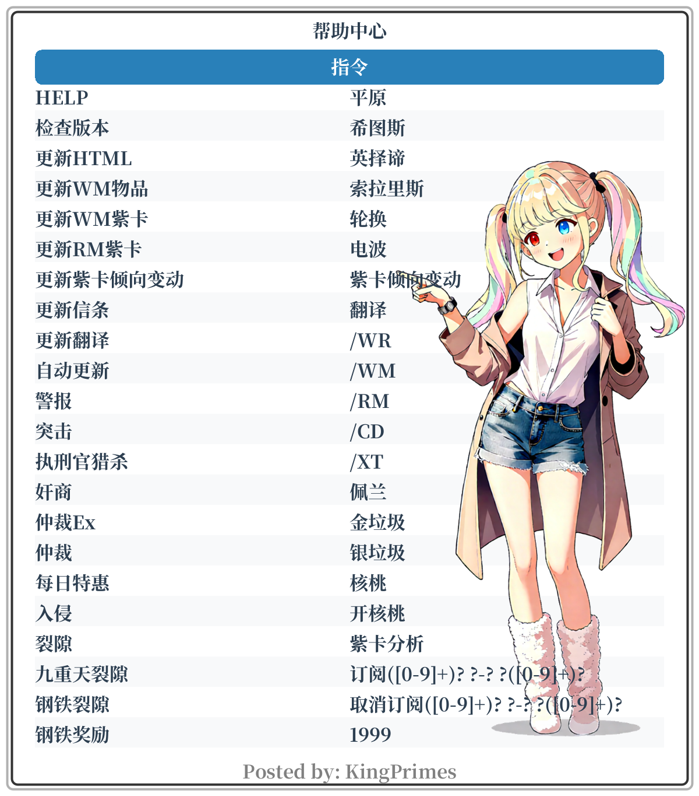
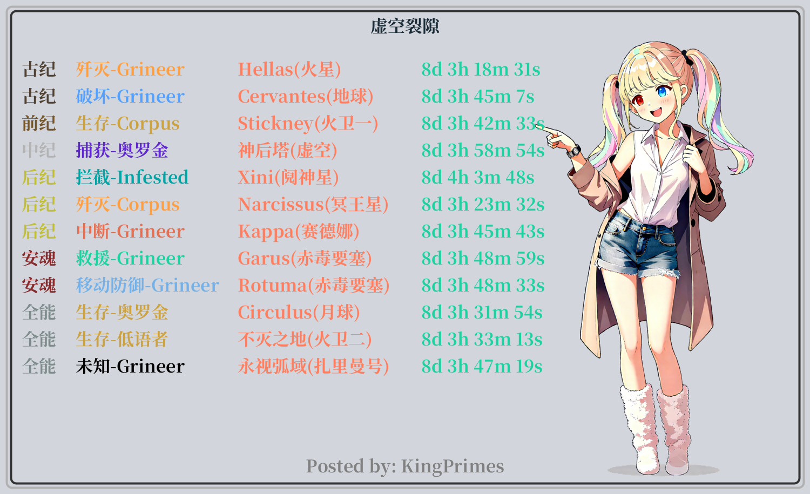
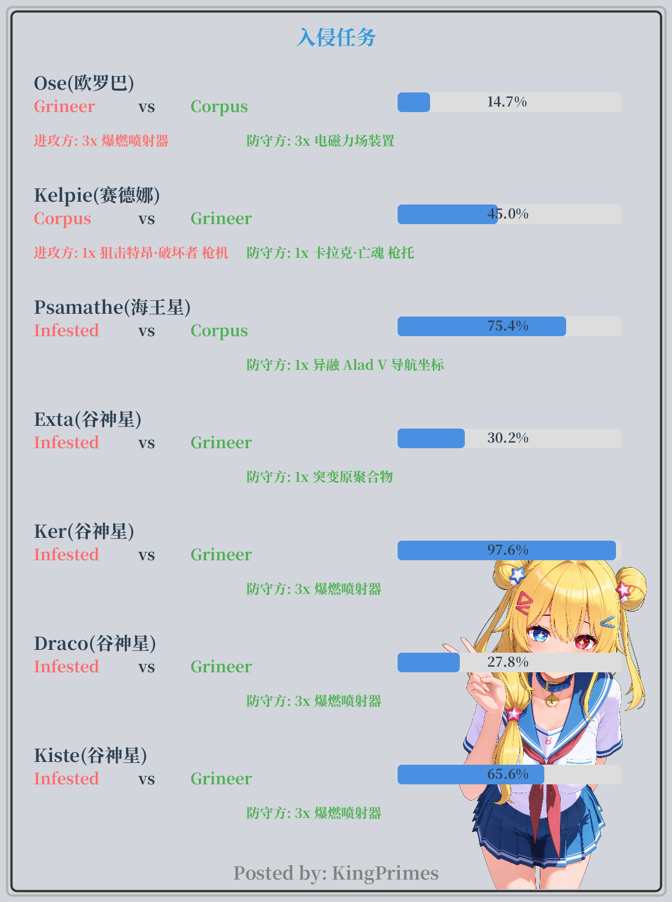
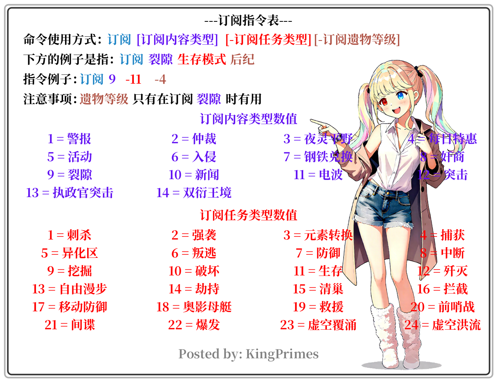
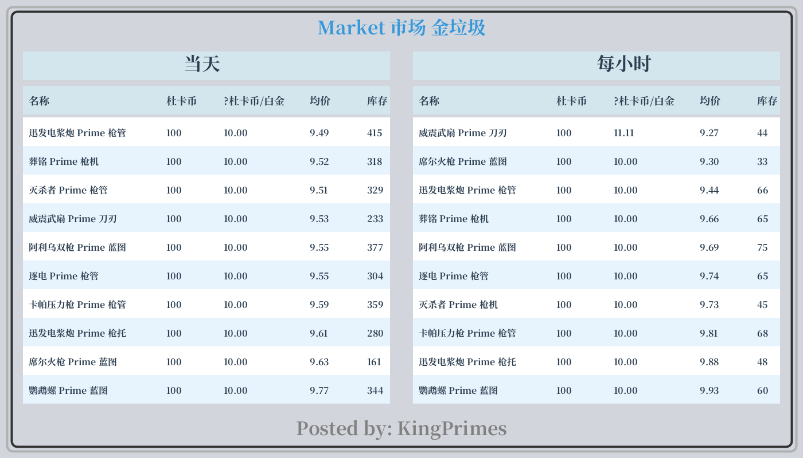

# DrawImagePlugin

[](https://search.maven.org/artifact/io.github.kingprimes/draw-image-plugin)
[](https://www.apache.org/licenses/LICENSE-2.0)


一个用于图像合成和绘制操作的Java库，专为Warframe游戏数据可视化而设计。

## 📌 简介

DrawImagePlugin是一个强大的Java图像处理库，主要用于将Warframe游戏数据（如任务、警报、市场信息等）转换为可视化图像。该库提供了丰富的API和默认实现，可以轻松生成各种格式的图像，适用于游戏机器人、数据展示面板等应用场景。

## 🚀 主要特性

- **丰富的图像绘制功能**：支持绘制警报、任务、市场信息、系统状态等多种游戏数据图像
- **高度可定制**：提供默认实现，同时支持插件化扩展
- **现代化设计**：基于Java 21开发，充分利用最新Java特性
- **高性能**：优化的图像处理算法，快速生成高质量图像
- **易于集成**：简单的API设计，方便快速集成到现有项目中

## 📦 安装

### Maven

```xml

<dependency>
    <groupId>io.github.kingprimes</groupId>
    <artifactId>draw-image-plugin</artifactId>
    <version>1.0.2</version>
</dependency>
```

### Gradle

```gradle
implementation 'io.github.kingprimes:draw-image-plugin:1.0.2'
```

## 🛠️ 使用示例

### 基本用法

```java
// 创建绘制插件实例
DrawImagePlugin plugin = new DefaultDrawImagePlugin();

// 绘制警报图像
byte[] alertImage = plugin.drawAlertsImage(alertsList);

// 绘制平原状态图像
byte[] cycleImage = plugin.drawAllCycleImage(allCycle);

// 绘制帮助图像
byte[] helpImage = plugin.drawHelpImage(helpInfoList);
```

## 🖼️ 图像示例

以下是一些使用本库生成的图像示例：

### 警报图像 (draw_alerts.png)



### 平原状态图像 (draw_all_cycle.png)



### 帮助图像 (draw_help.png)



### 任务图像 (draw_active_mission.png)



### 入侵图像 (draw_invasion.png)



### 订阅图像 (draw_warframe_subscribe.png)



### 市场杜卡币图像 (draw_market_god_dump.png)



## 📚 支持的图像类型

本库支持生成多种类型的游戏数据图像：

1. **基础信息类**
    - 帮助信息图像 (`drawHelpImage`)
    - 系统信息图像 (`drawAllInfoImage`)
    - 平原状态图像 (`drawAllCycleImage`)

2. **任务与活动类**
    - 警报图像 (`drawAlertsImage`)
    - 仲裁图像 (`drawArbitrationImage`)
    - 有价值仲裁图像 (`drawArbitrationsImage`)
    - 每日交易图像 (`drawDailyDealsImage`)
    - 双衍王境图像 (`drawDuviriCycleImage`)
    - 裂隙任务图像 (`drawActiveMissionImage`)
    - 入侵图像 (`drawInvasionImage`)
    - 1999日历季节图像 (`drawKnownCalendarSeasonsImage`)
    - 执刑官猎杀图像 (`drawLiteSoriteImage`)

3. **市场信息类**
    - 金垃圾杜卡币图像 (`drawMarketGodDumpImage`)
    - 银垃圾杜卡币图像 (`drawMarketSilverDumpImage`)
    - Lich拍卖图像 (`drawMarketLichesImage`)
    - Sister拍卖图像 (`drawMarketSisterImage`)

4. **订阅与通知类**
    - Warframe订阅图像 (`drawWarframeSubscribeImage`)

## 🧰 核心组件

### ImageCombiner 图像合成器

图像处理的核心组件，提供了一系列便捷的方法来绘制文本、图形和组合图像元素。

### DefaultDrawImagePlugin 默认绘制实现

提供了所有图像类型的默认实现，可以直接使用或作为自定义实现的参考。

### 工具类

- `ImageIOUtils`: 图像IO操作工具类
- `TextUtils`: 文本处理工具类
- `TimeUtils`: 时间处理工具类
- `Fonts`: 字体管理工具类

## 🧪 测试

项目包含完整的单元测试，可以通过以下命令运行：

```bash
mvn test
```

## 🤝 贡献

欢迎任何形式的贡献！如果您有改进建议或发现了bug，请：

1. Fork 本仓库
2. 创建您的特性分支 (`git checkout -b feature/AmazingFeature`)
3. 提交您的更改 (`git commit -m 'Add some amazing feature'`)
4. 推送到分支 (`git push origin feature/AmazingFeature`)
5. 开启一个 Pull Request

## 📄 许可证

本项目采用 Apache License 2.0 许可证。详情请见 [LICENSE](LICENSE) 文件。

## 👤 作者

**KingPrimes**

- GitHub: [@kingprimes](https://github.com/kingprimes)

## 🙏 鸣谢

- 感谢所有为项目贡献过代码的开发者
- 感谢使用本库的所有用户

---